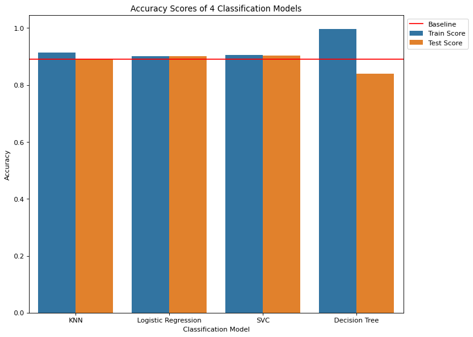
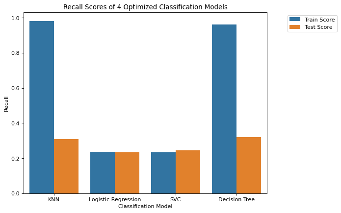

# Banking-Marketing-Analysis

This project is my third and last practical application from UC Berkeley's MLAI bootcamp. The task is to analyze a dataset of marketing banking campaigns through telephone to classify whether a client would subscribe to a deposit term or not. The full work and report can be found on this [notebook](https://github.com/DKW2/Banking-Marketing-Analysis/blob/main/banking-marketing-analysis.ipynb).

# Report
Starting with a dataset of 41188 entries, I first checked to see that the two classes are unbalanced with a split of around 90-10 (no, yes). I then proceeded to explore the data, taking note of categorical and numerical features as well as indentifying potential features to manipulate/remove. One feature that had to be removed was the "call duration" feature, since the feature can only be recorded during the call, not before.

Once I cleaned the data, I first created a baseline model to have a threshold for my models to beat. The model would always output "no", resulting in a baseline accuracy of around 88.9%. Once the baseline was established, I began training the classification models. For this project, I trained 4 different types of classification models: K-Nearest Neighbors (KNN), Logistic Regression, Support Vector Machines (SVC), and Decision Trees. For the first run, I trained all four models with their base settings, leading to these results:

As we can see, all four models performed around baseline accuracy except for the decision tree model doing slightly worse. From this, we can already see that separating the two classes will be difficult.

In the next run of models, I first changed the performance metric to be the recall rather than the accuracy. Recall is a better metric than accuracy for this data because we wish to get as many "yes" clients as possible from the data. In addition, accuracy isn't a great metric to use since we can already reach a 88.9% accuracy by just returning "no". Besides the performance metric, I also did more feature engineering and introduced hyperparameter grid searching to the models. With the grid searching, the models will be optimally tuned.

With all these changes, I created another batch of models:

As we can see, the best model was the decision tree model with a recall score of 0.338, which is low. Examining the models closely, we find that all of them are overfitting. Since the optimal model is an overfitted one, we can infer that there isn't any strong trend or correlating feature that determines whether the client subscribes or not. Even if we examine which features are impactful in our SVC model, every feature had very little impact. Although we can still use the model to classify clients, it will be severely inaccurate to the point of not being very helpful. Thus, with the currently provided dataset and features, we can't draw any strong correlations or predictions.

However, one interesting thing is that when we include "call duration" into our model training, the performance of our models increases almost two-fold:

Although "call duration" can't be used in prediction, it gives insight on what correlates well with the classification. It maybe worth investing in discovering features that detail the calls to see if there are more correlating features hidden there.

# Summmary

With a dataset of promotional campaigns from a Portugeuse banking institution, we tried training different classification models to predict whether a client would subscribe to a term deposit. From our investigation, we discovered that none of the features in the dataset had a strong correlation with identifying clients. The only exception was the duration of the call with clients, which cannot be part of the prediction because it can only be recorded during promotion, not before.

# Next Steps / Recommmendations

From our results, we have seen that it's difficult to identify potential clients willing to subscribe to a term deposit. There are no strong determining factor and our best models don't perform very well. Thus, instead of identifying clients, the bank should instead focus on their marketing campaign to attract more clients. This way, they will have a higher chance of discovering clients that will subscribe. Perhaps they could invest in better sales people or provide more manpower.

As for the next steps for this project, we will either need to recontexualize the problem or collect new data that could help classify clients more accurately.

For example, from our investigation, we discovered that call duration was the only feature that had a significant impact on our classification models. Thus, we could find features that relate to the calls themselves such as call time or quality of call, and add them into the next dataset. This way, we might have a better chance of training a more accurate model. If so, we would need to change the problem from identifying clients before marketing to identifying ways to attract clients during marketing. This way, we can inform the bank of ways to effectively promote and advertise to clients.

If we wish to stay with identifying potential clients, then we would probably need to find more features to record and utilize. Perhaps having more client information such as income, debt, and housing might help contribute to a more accurate model.

# Reflection

Although I believe I did a thorough investigation in this project, I believe I could have organized it better. For example, perhaps I could have utilized the full dataset for training to get a better understanding before engineering the features. In addition, I believe I could improve on the hyperparameter grid searches by adding more parameters. However, I feel like I've already done such an exhaustive search that perhaps there might not be much impact. Lastly, I think I should have separated the different groups of models better by creating individual training methods and data splits for each group.

